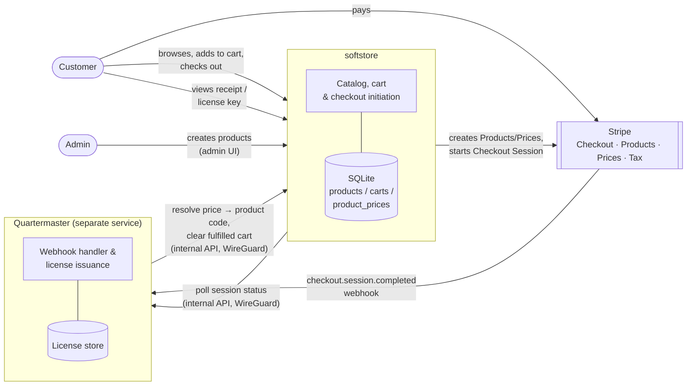
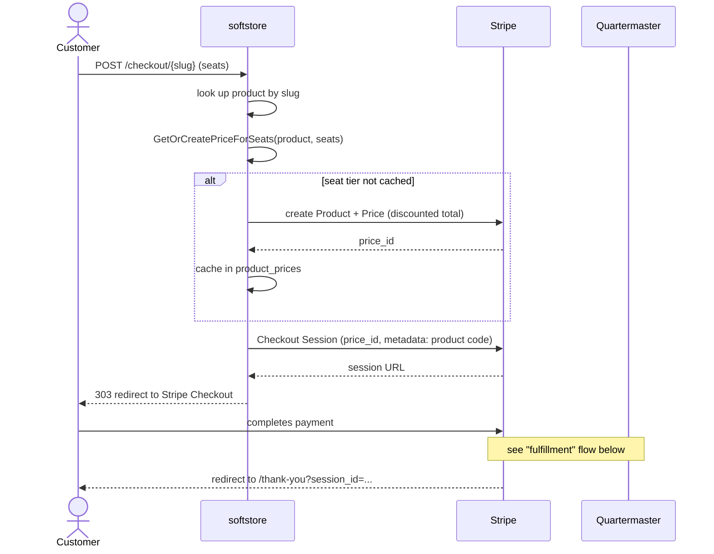
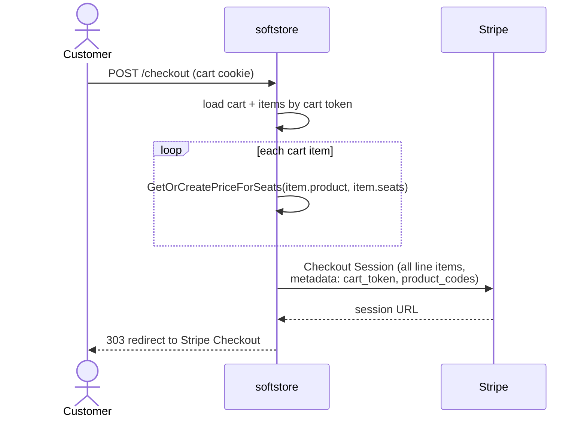
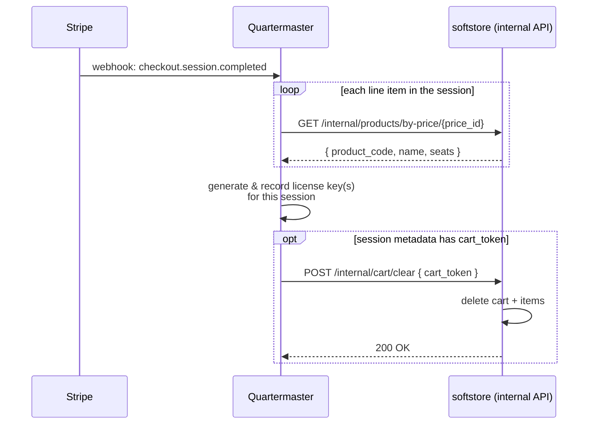
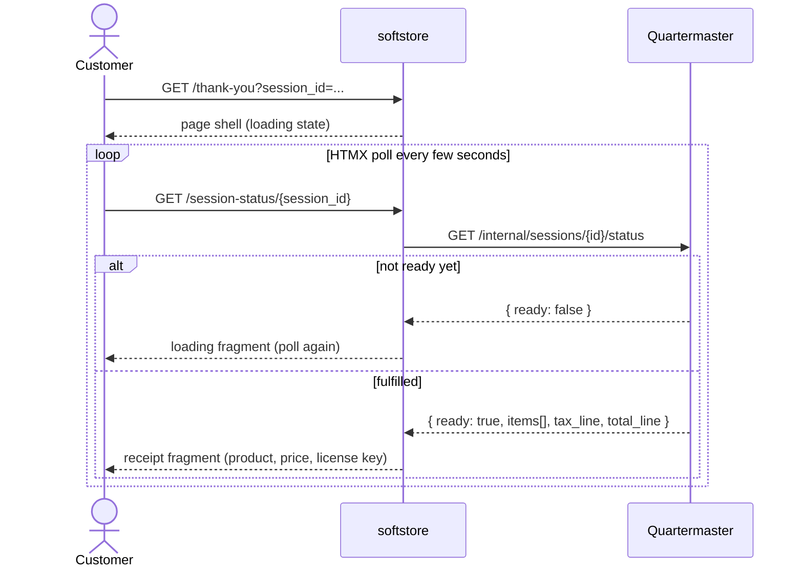
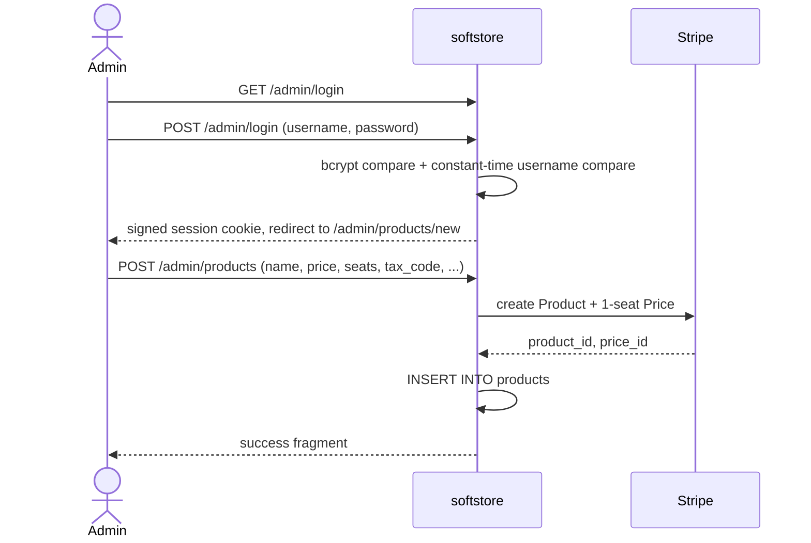
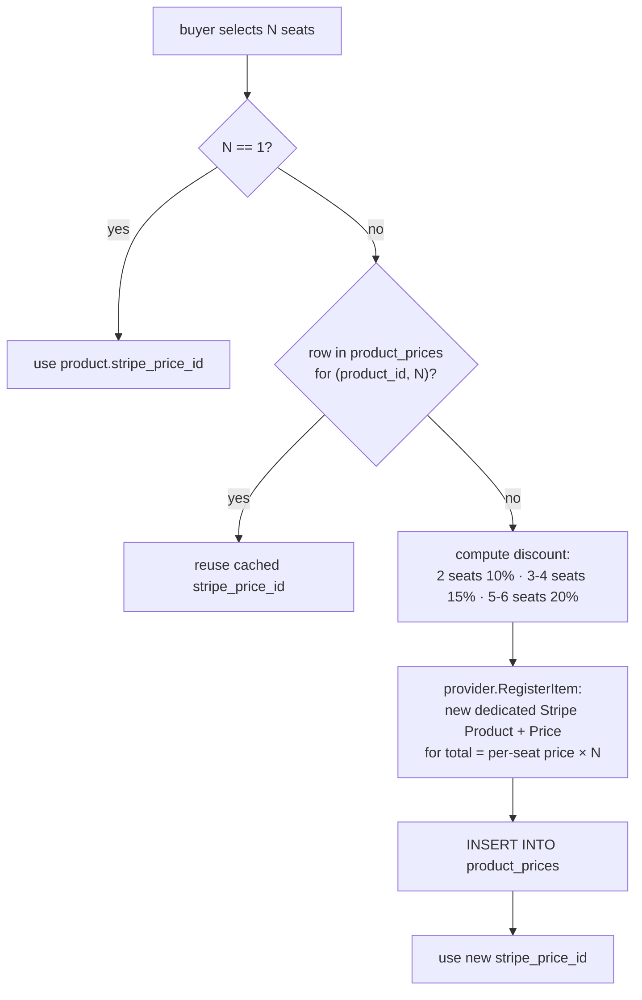
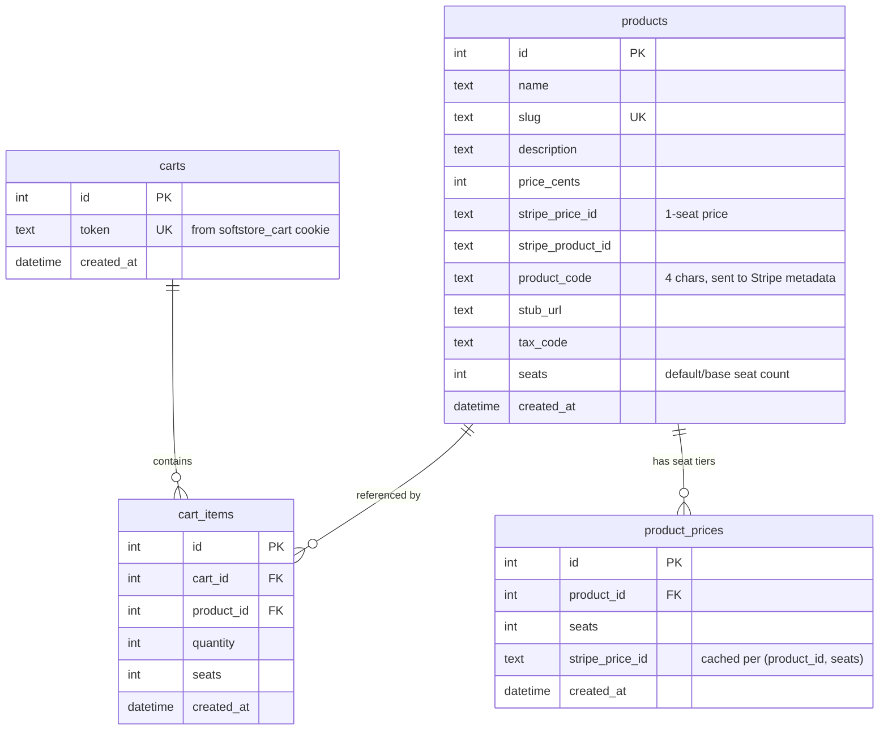
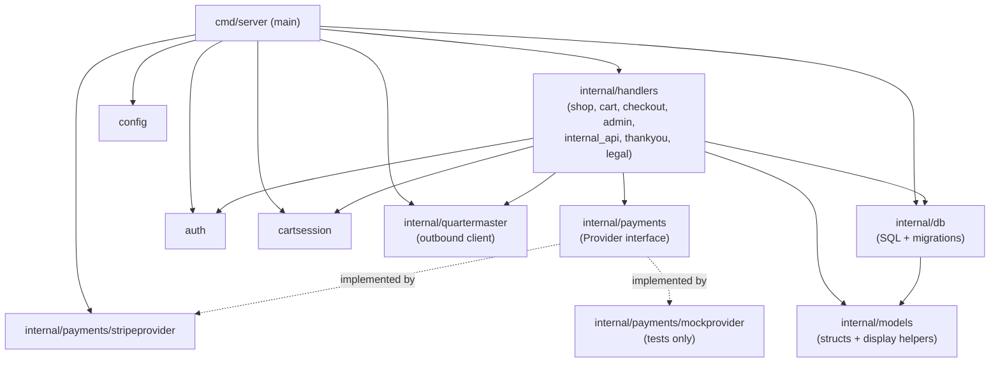

# Architecture

This document describes how softstore is put together internally, and — in the most
detail — how it collaborates with **Quartermaster**, the sibling service that turns a
completed Stripe payment into a delivered license key.

If you just want to run the app, see the [README](../README.md).

## Table of contents

- [System overview](#system-overview)
- [Service boundary: softstore vs. Quartermaster](#service-boundary-softstore-vs-quartermaster)
- [The softstore ⇄ Quartermaster contract](#the-softstore--quartermaster-contract)
- [Flow: single-item checkout](#flow-single-item-checkout)
- [Flow: cart checkout](#flow-cart-checkout)
- [Flow: fulfillment webhook → license issuance → cart clear](#flow-fulfillment-webhook--license-issuance--cart-clear)
- [Flow: thank-you page polling](#flow-thank-you-page-polling)
- [Flow: admin creates a product](#flow-admin-creates-a-product)
- [Seat-tier pricing](#seat-tier-pricing)
- [Data model](#data-model)
- [Package layout](#package-layout)
- [Security model](#security-model)

## System overview

softstore is the customer-facing storefront: product catalog, cart, and checkout
initiation. It never issues or stores license keys itself — that responsibility
belongs entirely to Quartermaster, which reacts to Stripe webhooks after a purchase
completes. The two services never share a database; they only talk to each other over
two small internal HTTP APIs, tunneled over WireGuard in production and authenticated
with a static shared secret (`INTERNAL_API_SECRET`).



## Service boundary: softstore vs. Quartermaster

| | softstore | Quartermaster |
|---|---|---|
| Owns | Product catalog, pricing, cart, checkout initiation | License generation, delivery, fulfillment records |
| Database | SQLite (`products`, `carts`, `cart_items`, `product_prices`) | Its own store (opaque to softstore) |
| Talks to Stripe for | Creating Products/Prices, starting Checkout Sessions | Receiving `checkout.session.completed` webhooks |
| Exposes internally | `GET /internal/products/by-price/{price_id}`, `POST /internal/cart/clear` | `GET /internal/sessions/{id}/status` |
| Calls the other service to | Poll fulfillment status for the thank-you page | Resolve a Stripe Price ID to a product code + seat count; clear a buyer's cart after fulfillment |

Neither service ever calls the other's public/customer-facing routes — all
cross-service traffic goes through the `/internal/*` namespace on each side, gated by
`RequireInternalSecret` and reachable only over the WireGuard tunnel between the two
hosts.

## The softstore ⇄ Quartermaster contract

This is the interface surface that must stay in sync across both repositories. Changing
any of these shapes is a cross-repo breaking change.

**softstore → Quartermaster**

```
GET {QUARTERMASTER_INTERNAL_URL}/internal/sessions/{session_id}/status
X-Internal-Secret: <INTERNAL_API_SECRET>

200 OK
{
  "found":      bool,
  "ready":      bool,
  "items": [
    { "product_name": string, "amount_line": string, "license_key": string }
  ],
  "tax_line":   string,
  "total_line": string
}
```
(`internal/quartermaster/client.go`)

**Quartermaster → softstore**

```
GET /internal/products/by-price/{price_id}
X-Internal-Secret: <INTERNAL_API_SECRET>

200 OK
{ "product_code": string, "name": string, "seats": int64 }
404  if no product or product_prices row matches that Stripe Price ID
```

```
POST /internal/cart/clear
X-Internal-Secret: <INTERNAL_API_SECRET>
Content-Type: application/json
{ "cart_token": string }

200 OK
400  if cart_token is missing
```
(`internal/handlers/internal_api.go`)

**Checkout metadata** — softstore stamps every Stripe Checkout Session with metadata
that Quartermaster's webhook handler reads to know what was purchased:

| Field | Set by | Meaning |
|---|---|---|
| `product` | `Checkout` (single-item) | The purchased product's 4-character `product_code` |
| `cart_token` | `CartCheckout` (cart flow) | The buyer's cart cookie token, so Quartermaster can tell softstore to clear it after fulfillment |
| `product_codes` | `CartCheckout` (cart flow) | Comma-joined `product_code`s for every line item in the cart |

Quartermaster resolves *per-line-item* product/seat detail via
`GET /internal/products/by-price/{price_id}` rather than parsing it out of metadata,
since a single checkout session can contain several distinct seat-tier Prices for the
same or different products.

## Flow: single-item checkout

Triggered from a product's "Buy now" button (`POST /checkout/{slug}`), bypassing the
cart entirely.



## Flow: cart checkout

Triggered from the cart drawer (`POST /checkout`). One Stripe Checkout Session is built
from every line item in the cart, each potentially at a different seat tier.



## Flow: fulfillment webhook → license issuance → cart clear

This is the core cross-service handoff. It happens entirely outside softstore's request
path — Stripe calls Quartermaster directly, and Quartermaster calls back into
softstore's internal API as needed.



Quartermaster owns everything after license generation (storage, delivery) — softstore
has no visibility into it beyond the receipt data exposed via
`GET /internal/sessions/{id}/status`, described next.

## Flow: thank-you page polling

Stripe's success URL sends the customer to `/thank-you?session_id=...`, which renders
immediately in a loading state (fulfillment may still be in flight — Stripe's webhook
can arrive after the redirect does). An HTMX fragment polls softstore, which in turn
polls Quartermaster, until the receipt is ready.



A failed poll (network hiccup, Quartermaster momentarily unreachable) is treated as
"not ready yet" rather than an error, so the UI just retries on the next tick.

## Flow: admin creates a product

Product creation is the one place softstore registers a brand-new Stripe Product —
every seat tier created later reuses the pricing helper shown above, but always starts
from a product created here.



## Seat-tier pricing

A product's `stripe_price_id` (set at creation) is always its 1-seat price.
Multi-device tiers (2–6 devices) are created lazily on first purchase and cached for
every buyer after that — `GetOrCreatePriceForSeats` in
`internal/handlers/product_pricing.go`:



Each seat tier gets its **own** Stripe Product+Price rather than a Price attached to a
shared, mutated Product — a cart can hold several tiers of the same product at once,
and each line item must show its own tier at checkout simultaneously, which a single
mutable Product description can't do.

## Data model



`cart_items` is unique on `(cart_id, product_id, seats)` — the same product at two
different seat counts is two separate line items. `product_prices` is unique on
`(product_id, seats)`, which is what makes the seat-tier cache safe to look up and
insert without duplicating Stripe Products.

Migrations are plain idempotent `CREATE TABLE IF NOT EXISTS` statements run at startup
(`internal/db/db.go`) — there's no migration framework or version table.

## Package layout



Handlers depend only on the `payments.Provider` interface, never on the Stripe SDK
directly — `stripeprovider` is the real implementation, `mockprovider` is a hand-rolled
test double used throughout the handler test suite.

## Security model

- **Admin auth** (`internal/auth`): a single hardcoded admin user, bcrypt password hash
  checked with `bcrypt.CompareHashAndPassword`, username compared in constant time. On
  success, an HMAC-SHA256-signed, expiring (24h) session token is set as an
  `HttpOnly`, `SameSite=Strict` cookie. There's no session store — the cookie itself is
  the credential, verified statelessly on each request against `SESSION_SECRET`.
- **Cart identity** (`internal/cartsession`): an anonymous random-token cookie
  (`SameSite=Lax`, 30 days), unauthenticated by design — it identifies a guest's cart,
  not a user.
- **Service-to-service** (`internal/handlers/middleware.go`): both directions of the
  softstore ⇄ Quartermaster contract are guarded by `RequireInternalSecret`, comparing
  the `X-Internal-Secret` header against `INTERNAL_API_SECRET` with
  `crypto/subtle.ConstantTimeCompare`. This is the only auth on those routes — network
  isolation (WireGuard-only reachability in production) is what keeps them from being
  internet-facing.
- **Secure cookies are opt-in via config**: `internal/auth.SecureCookies` and
  `internal/cartsession.SecureCookies` both default to `true` as package variables, but
  `main.go` always overwrites them from `config.SecureCookies()`, which reads
  `SECURE_COOKIES` and returns `true` only if it's exactly `"true"`. Production must set
  `SECURE_COOKIES=true` explicitly; local HTTP development can leave it unset.
